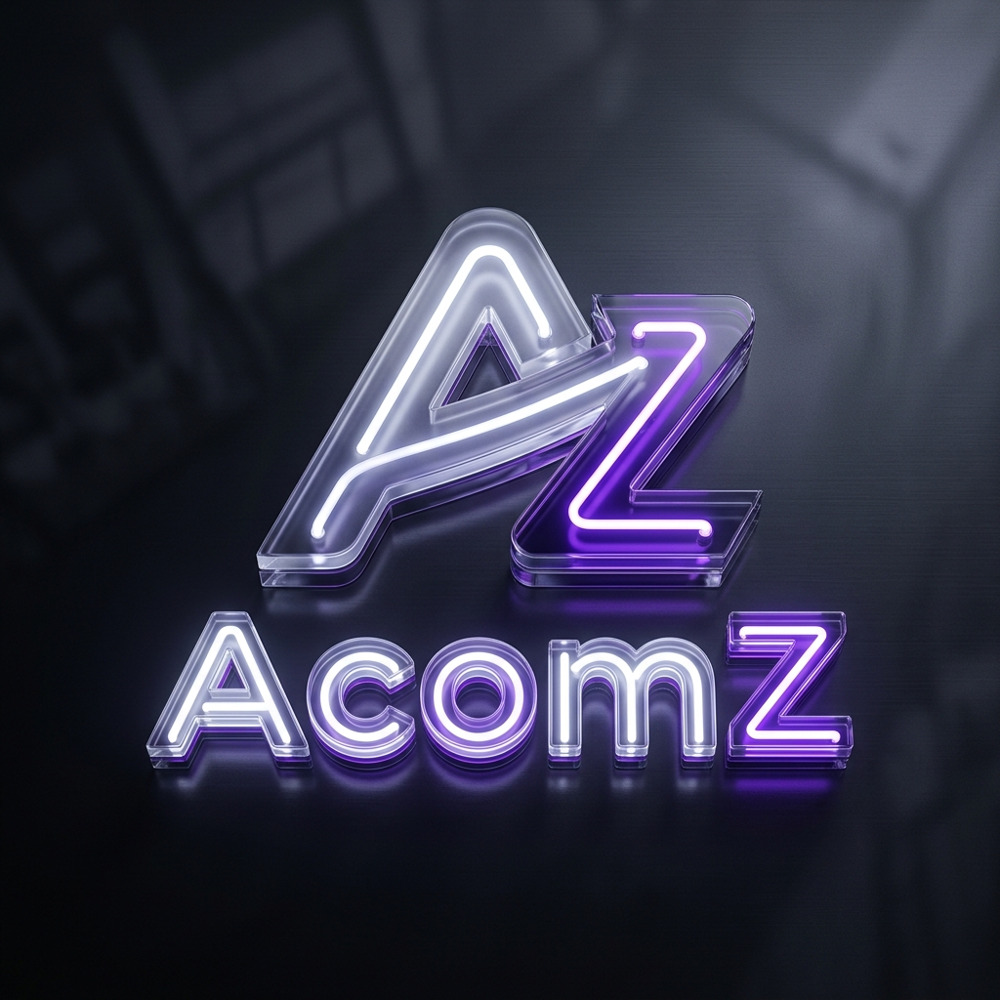
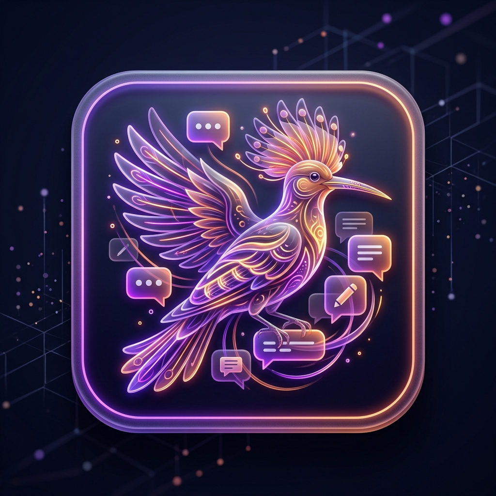
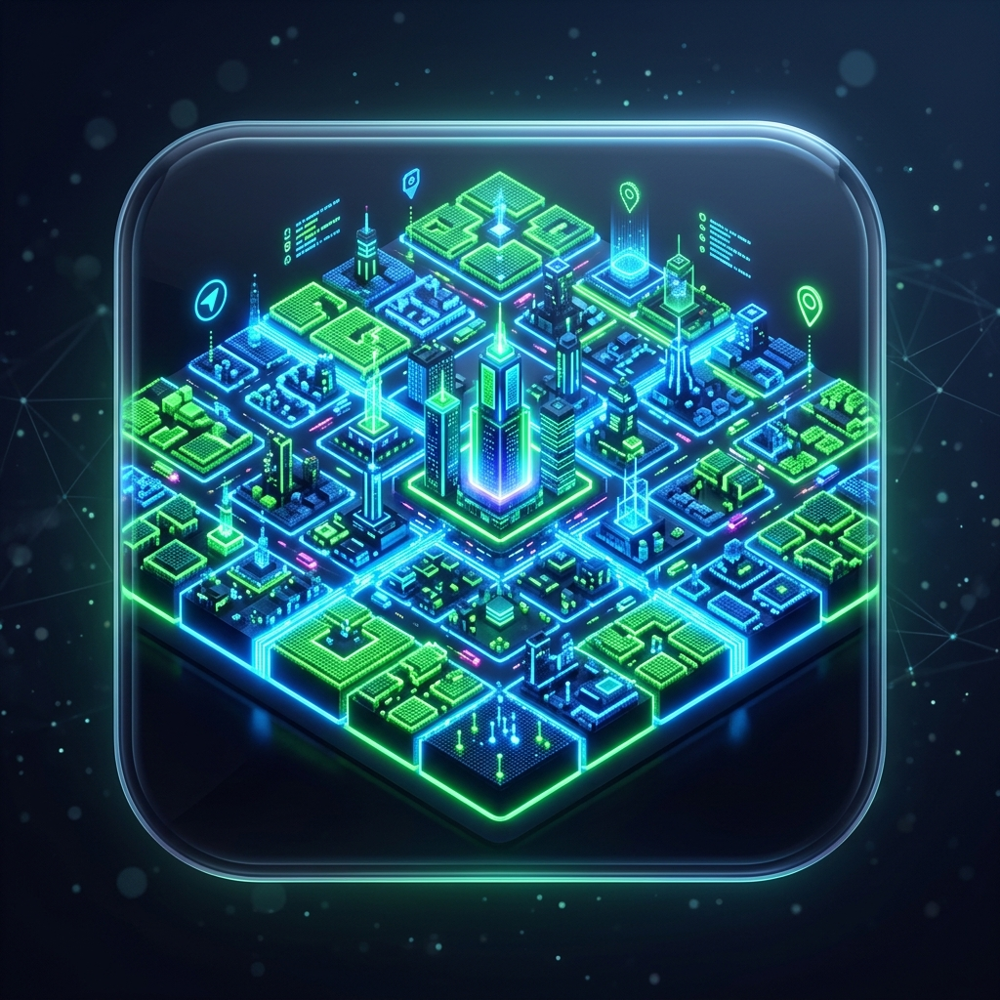

  
  <h1>AcomZ Ecosystem</h1>
  
  

    
    &nbsp;&nbsp;&nbsp;&nbsp;&nbsp;&nbsp;
    
  

---

## 🚀 The Y Combinator of Digital Communities

**AcomZ** is more than just a software platform—it is an incubator and central hub for specialized digital communities, functioning similarly to **Y Combinator** for tech startups. 

Just as Y Combinator provides the capital, guidance, and networking infrastructure for startups to rapidly scale, **AcomZ provides the foundational digital infrastructure** (Unified SSO, cross-app traffic routing, shared UI design systems, and global moderation) for a suite of interconnected applications.

Instead of users navigating isolated silos, they enter the AcomZ ecosystem where their identity, reputation (like community moderator statuses), and social connections seamlessly translate across entirely different applications. 

### 🌟 The Apps

1. **AcomZ Portal (`startup_main`)**
   The unified gateway and administrative dashboard. It handles central routing, global theme/language contexts, and cross-app traffic analytics.

2. **Hudhud / شات AcomZ (`chat_app`)**
   A mobile-first, hyper-local community platform. It features Hudhud/TikTok-inspired blurred media experiences, location-aware feeds, and a self-regulating community moderation system.

3. **Riyadh Pixel / بيكسل الرياض (`riyadh_app`)**
   A digital real estate platform. It uses advanced formal grid-generation algorithms to subdivide the real map of Riyadh into thousands of purchasable, interactive digital pixel lands while strictly avoiding road networks.
